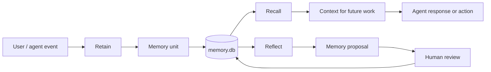
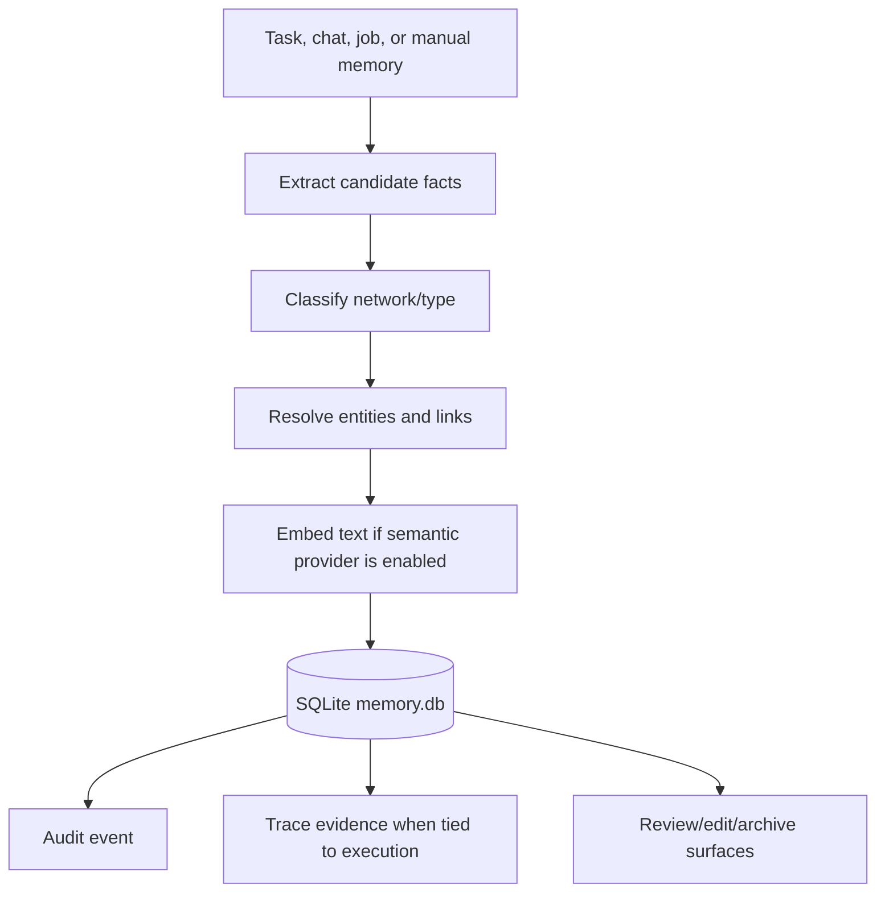
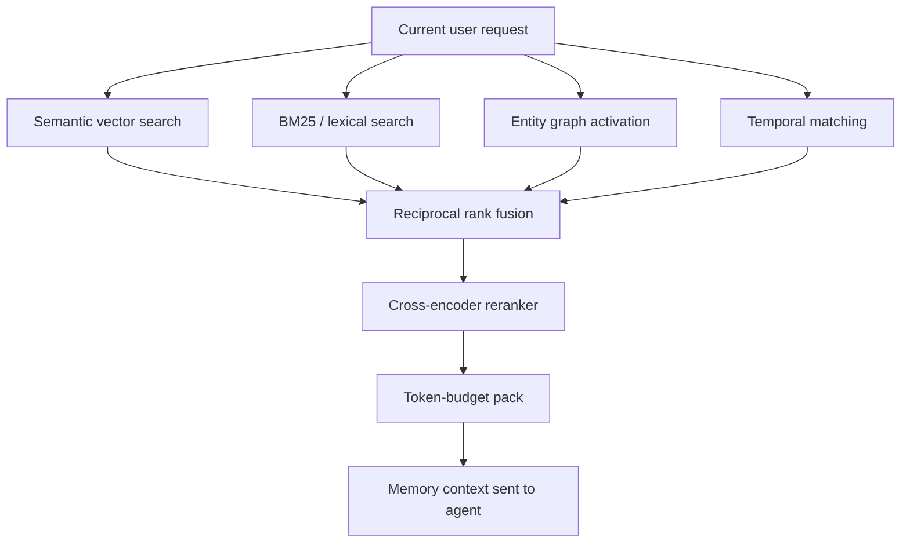
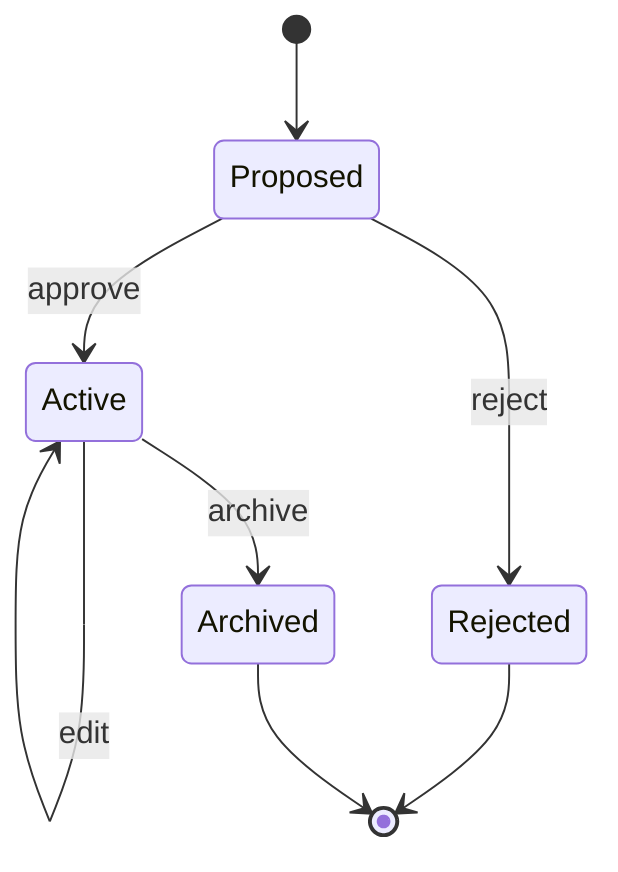

# Memory

Gini memory is visible, governable, and local by default.

Memory records live in `~/.gini/instances/<instance>/memory.db` using SQLite. The model cache for local embeddings and reranking lives in `~/.gini/models/`.

Memory is scoped per agent. Each agent owns its own pool — banks, units, and legacy memory records all carry the active agent id, and recall filters on it across every channel. Switching the active agent changes which memories are recalled and pinned. New agents start with an empty pool; configuration is copied at creation, content is not. See [ADR agent-memory-isolation.md](./adr/agent-memory-isolation.md) for the isolation contract.

## Mental Model



Memory is not hidden prompt stuffing. Gini records memory units with provenance, retrieves them through multiple signals, and keeps review surfaces available for proposed or generated changes.

## Memory Operations

- **Retain:** write a memory unit with source/provenance metadata.
- **Recall:** retrieve relevant memory with semantic, lexical, graph, and temporal signals.
- **Reflect:** propose higher-level memory from existing evidence.
- **Reinforce:** update strength and relationships as memories are used.
- **Review:** edit, approve, reject, or archive memory records.

## Retain Flow



Retain keeps enough metadata to answer: where did this memory come from, what entities does it touch, what model embedded it, and what runtime action created it.

## Recall Pipeline

Recall fuses four channels:

- semantic vector search
- BM25/lexical search
- graph spreading activation
- temporal recency and cadence

Results are combined with reciprocal rank fusion, reranked over the top candidates, and packed into a token budget.



The four channels cover different failure modes:

- semantic catches meaning even when words differ
- lexical catches exact names, commands, and phrases
- graph catches related entities and relationships
- temporal catches time-sensitive facts and recent context

## Review And Governance



Agent-created memory should stay inspectable. Review states make it possible to accept useful memories, reject bad ones, and archive outdated facts without deleting provenance.

## Embeddings

Providers:

- `local` by default: Transformers.js with `Xenova/all-MiniLM-L6-v2`
- `openai`: `text-embedding-3-small`
- `echo`: deterministic test provider

Useful commands:

```sh
bun run gini embedding status
bun run gini embedding reembed
```

Environment overrides:

```sh
GINI_EMBEDDING_PROVIDER=local|openai|echo
GINI_LOCAL_EMBEDDING_MODEL=<hf-id>
```

Different embedding models use different vector spaces. Switching providers does not destroy existing memories, but semantic recall only uses memory units embedded by the active model until they are re-embedded.

## Reranker

Providers:

- `local` by default: Transformers.js with `Xenova/ms-marco-MiniLM-L-6-v2`
- `echo`: deterministic test provider
- `none`: skip cross-encoder reranking

Useful commands:

```sh
bun run gini reranker status
```

Environment overrides:

```sh
GINI_RERANKER_PROVIDER=local|echo|none
GINI_LOCAL_RERANKER_MODEL=<hf-id>
GINI_RERANKER_TOP_N=<int>
```

Smoke tests pin echo providers so parallel smoke runs and CI do not download models.

## Current Surfaces

After the state.memories consolidation (see ADR
memory-surface-consolidation.md):

- `USER.md` — instance-scoped user-identity surface. Edits via
  `edit_user_profile` (auto-approved).
- `SOUL.md` — per-agent persona. Edits via `edit_soul` (propose →
  approve via `POST /api/identity-files/soul/approve`).
- Hindsight — per-agent SQLite bank populated by auto-retain at task
  end; queried by recall on each turn and the `recall_memory` tool.
- `gini memory {retain|recall|reflect|units|banks|migrate}`
- `/api/memory/retain`, `/api/memory/recall`, `/api/memory/reflect`,
  `/api/memory/units`, `/api/memory/banks`
- web Memory page (Hindsight only)

## Direction

Memory should become more useful without becoming hidden magic. Future work should improve contradiction handling, compaction, bank governance, provenance, and review workflows.
