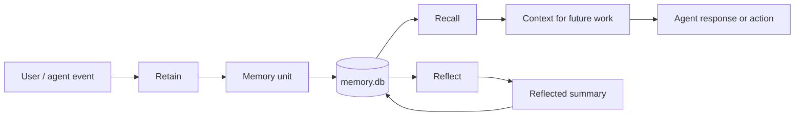
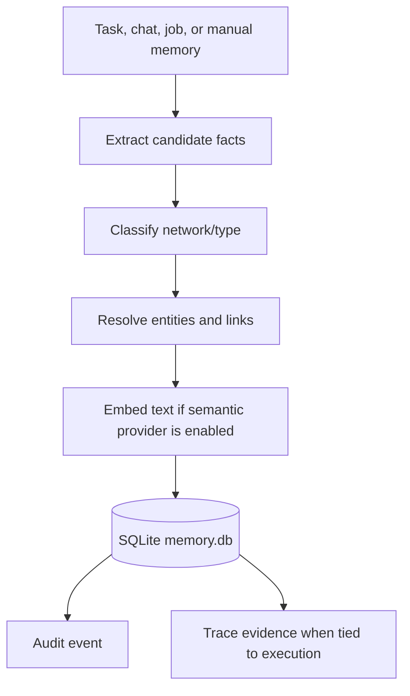
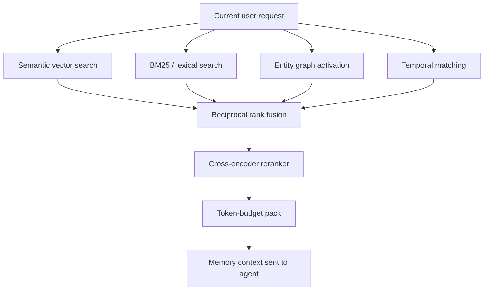

# Memory

Gini memory is visible, governable, and local by default.

Gini has three memory surfaces (see [ADR runtime-identity-files.md](./adr/runtime-identity-files.md) for the partition):

- **USER.md** — instance-scoped user identity, always injected into the prompt. Edited via the `edit_user_profile` tool, auto-approved when the injection scan passes (a flagged body routes through `.proposed` for review).
- **SOUL.md** — per-agent persona, always injected. Edited via the `edit_soul` tool which always routes through `.proposed` for user approval.
- **Hindsight** — per-agent SQLite bank populated automatically by auto-retain at the end of every chat task. Queried by recall on each turn and by the `recall_memory` tool on demand.

This document covers Hindsight; USER.md / SOUL.md are documented in [runtime-identity-files.md](./adr/runtime-identity-files.md).

Hindsight units live in `~/.gini/instances/<instance>/memory.db` using SQLite. The model cache for local embeddings and reranking lives in `~/.gini/models/`.

Hindsight is scoped per agent. Each agent owns its own bank, units carry the active agent id, and recall filters on it across every channel. Switching the active agent changes which memories are recalled. New agents start with an empty bank; configuration is copied at creation, content is not. See [ADR agent-memory-isolation.md](./adr/agent-memory-isolation.md) for the isolation contract.

## Mental Model



Memory is not hidden prompt stuffing. Hindsight records memory units with provenance and retrieves them through multiple signals on demand.

## Memory Operations

- **Retain:** write a memory unit with source/provenance metadata. The auto-retain pipeline runs at the end of every chat task and populates the bank without any tool call.
- **Recall:** retrieve relevant memory with semantic, lexical, graph, and temporal signals. Surfaced via the `recall_memory` tool and the per-turn automatic recall.
- **Reflect:** propose higher-level memory from existing evidence.
- **Reinforce:** update strength and relationships as memories are used.

## Retain Flow



Retain keeps enough metadata to answer: where did this memory come from, what entities does it touch, what model embedded it, and what runtime action created it.

## Recall Pipeline

Recall fuses four channels:

- semantic vector search
- BM25/lexical search
- graph spreading activation
- temporal recency and cadence

Results are combined with reciprocal rank fusion, reranked over the top candidates, and packed into a token budget.



The four channels cover different failure modes:

- semantic catches meaning even when words differ
- lexical catches exact names, commands, and phrases
- graph catches related entities and relationships
- temporal catches time-sensitive facts and recent context

## Review And Governance

Hindsight units do not flow through a propose/approve gate — auto-retain writes them directly to the bank. Provenance metadata (source task, source trace ids, embedding model) is recorded with every unit so the user can review them on the Memory page and prune individual units as needed. Curated identity facts go through the propose/approve gate for USER.md and SOUL.md instead, see [ADR runtime-identity-files.md](./adr/runtime-identity-files.md).

## Embeddings

Providers:

- `local` by default: Transformers.js with `Xenova/all-MiniLM-L6-v2`
- `openai`: `text-embedding-3-small`
- `echo`: deterministic test provider

Useful commands:

```sh
bun run gini embedding status
bun run gini embedding reembed
```

Environment overrides:

```sh
GINI_EMBEDDING_PROVIDER=local|openai|echo
GINI_LOCAL_EMBEDDING_MODEL=<hf-id>
```

Different embedding models use different vector spaces. Switching providers does not destroy existing memories, but semantic recall only uses memory units embedded by the active model until they are re-embedded.

## Reranker

Providers:

- `local` by default: Transformers.js with `Xenova/ms-marco-MiniLM-L-6-v2`
- `echo`: deterministic test provider
- `none`: skip cross-encoder reranking

Useful commands:

```sh
bun run gini reranker status
```

Environment overrides:

```sh
GINI_RERANKER_PROVIDER=local|echo|none
GINI_LOCAL_RERANKER_MODEL=<hf-id>
GINI_RERANKER_TOP_N=<int>
```

Smoke tests pin echo providers so parallel smoke runs and CI do not download models.

## Hindsight Surfaces

- `gini memory {retain|recall|reflect|units|banks|migrate}` — CLI subcommands.
- `/api/memory/retain`, `/api/memory/recall`, `/api/memory/reflect`, `/api/memory/units`, `/api/memory/banks` — API contracts.
- The `recall_memory` agent tool (default `memory` toolset).
- The web Memory page.

## Direction

Memory should become more useful without becoming hidden magic. Future work should improve contradiction handling, compaction, bank governance, provenance, and review workflows.
